# FinTrace

### Executive claims checked against filed numbers.

```text
LLM finds
    -> Code calculates
    -> Filing explains
    -> Validator verifies
    -> Human decides
```

One example explains the product:

```text
Management claim:       23.00% organic growth
Filed calculation:      (124 - 110) / 110 = 12.73%
Difference:              10.27 percentage points
Filing reconciliation:  none found
Final result:            UNRESOLVED
```

FinTrace is an independent evidence-first financial review pipeline. It compares statements from an earnings call with filed financial data, recomputes numerical claims in code, searches the filing for legitimate explanations, and preserves every decision for human review.

The included case uses a clearly labeled fictional company. FinTrace describes observable inconsistencies and does not infer intent or accuse a company or person of wrongdoing.

The benchmark uses fictional companies and controlled disclosures.

> **Design boundary:** The Python engine (`fintrace/`) is the authoritative implementation. The public Next.js page presents a versioned fictional fixture for demo reliability and does not execute the pipeline live in the browser. This is an intentional design choice, not a limitation of the workflow — full live execution is available via `python -m fintrace demo --provider live`.

## What happens inside

```mermaid
%%{init: {"flowchart": {"curve": "stepAfter", "nodeSpacing": 40, "rankSpacing": 55}, "themeVariables": {"fontSize": "18px", "fontFamily": "Arial, sans-serif"}}}%%
flowchart TB
    subgraph ROW1[" "]
    direction LR
    INPUT["INPUT<br/>Earnings-call transcript + filed financial data<br/>Controlled benchmark: 12 cases / 13 findings"]

    S1["1. INGEST & ALIGN<br/>DETERMINISTIC PYTHON<br/>Adapter: ingest_and_align<br/>Maps claims, speakers, periods, metrics, and filing references"]

    subgraph SG2["2. SPECIALIST CALLS - LLM"]
        direction TB
        S2IN["Aligned claims + filing corpus<br/>Benchmark sends all 12 cases in one batch per scope"]
        REV["Revenue specialist<br/>revenue_v1<br/>LiveLLMProvider<br/>llama-3.3-70b-versatile, T=0"]
        CASH["Cash-flow specialist<br/>cash_flow_v1<br/>LiveLLMProvider<br/>llama-3.3-70b-versatile, T=0"]
        RP["Related-party specialist<br/>related_party_v1<br/>LiveLLMProvider<br/>llama-3.3-70b-versatile, T=0"]
        LANG["Language specialist<br/>language_v1<br/>LiveLLMProvider<br/>llama-3.3-70b-versatile, T=0"]
        S2OUT["Schema-validated candidate findings<br/>with scope provenance"]
        S2IN --> REV --> S2OUT
        S2IN --> CASH --> S2OUT
        S2IN --> RP --> S2OUT
        S2IN --> LANG --> S2OUT
    end

    S3["3. AGGREGATE & DEDUPE<br/>DETERMINISTIC PYTHON - NOT AN LLM CALL<br/>Adapter: aggregate_findings / deterministic-deduplicator<br/>Groups by claim identity, preserves sources, assigns stable IDs"]
    end

    subgraph ROW2[" "]
    direction LR
    S4["4. CODE CALCULATION<br/>DETERMINISTIC PYTHON - AUTHORITATIVE MATH<br/>Adapter: reconcile_claims + attach_calculations v1.0<br/>Computes value, gap, tolerance result, and filing references"]

    S5["5. FILING RETRIEVAL<br/>DETERMINISTIC PYTHON<br/>Adapter: retrieve_filing_evidence v1.0<br/>Ranks filing passages and claim-linked disclosures"]

    subgraph SG6["6. SECOND-PASS<br/>VALIDATION"]
        direction TB
        LLM2["Second-pass reviewer - LLM<br/>second_pass_v1<br/>LiveLLMProvider<br/>llama-3.3-70b-versatile, T=0<br/>Proposes EXPLAINED or UNRESOLVED"]
        QV["Quote + relevance gate<br/>DETERMINISTIC PYTHON<br/>validate_explanation_quotes<br/>Exact quote present? Directly related? Numerical gap reconciled?"]
        OK["Validated result<br/>EXPLAINED"]
        FAIL["Fail closed<br/>UNRESOLVED"]
        LLM2 -->|"proposed decision + quote/reasoning"| QV
        QV -->|"all required gates pass"| OK
        QV -->|"missing, unrelated, or non-reconciling evidence"| FAIL
    end
    end

    subgraph ROW3[" "]
    direction LR
    S7["7. ANALYST REVIEW<br/>HUMAN INPUT REQUIRED<br/>Evidence chain + neutral risk memo<br/>Analyst chooses accept, reject, or needs_review"]

    S8["8. HUMAN SIGN-OFF<br/>HUMAN INPUT REQUIRED<br/>Named reviewer + note + timestamp<br/>Final judgment remains outside the model"]

    OUTPUT["OUTPUT<br/>Versioned JSON report + evidence trail + review state<br/>Explained findings and preserved unresolved findings"]
    end

    INPUT -->|"raw claims and filing content"| S1
    S1 -->|"aligned claims + filing references"| S2IN
    S2OUT -->|"candidate findings by specialist scope"| S3
    S3 -->|"deduplicated findings + provenance"| S4
    S4 -->|"code-derived values + gaps + tolerances"| S5
    S5 -->|"findings + calculations + candidate passages + full filing"| LLM2
    OK -->|"validated explanation package"| S7
    FAIL -->|"unresolved evidence package"| S7
    S7 -->|"analyst decision and note"| S8
    S8 -->|"signed review record"| OUTPUT

    classDef llm fill:#dbeafe,stroke:#2563eb,color:#0f172a,stroke-width:2px;
    classDef code fill:#fef3c7,stroke:#d97706,color:#0f172a,stroke-width:2px;
    classDef human fill:#dcfce7,stroke:#16a34a,color:#0f172a,stroke-width:2px;
    classDef unresolved fill:#fee2e2,stroke:#dc2626,color:#0f172a,stroke-width:2px;
    classDef io fill:#f1f5f9,stroke:#475569,color:#0f172a,stroke-width:2px;

    class REV,CASH,RP,LANG,LLM2 llm;
    class S1,S3,S4,S5,QV code;
    class S7,S8 human;
    class FAIL unresolved;
    class INPUT,OUTPUT,S2IN,S2OUT,OK io;

    style ROW1 fill:transparent,stroke:transparent
    style ROW2 fill:transparent,stroke:transparent
    style ROW3 fill:transparent,stroke:transparent
```



[Download the submission-ready PNG](public/fintrace-ml-workflow.png) or edit the [Mermaid source](docs/fintrace-ml-workflow.mmd).

### 1. Ingest and align

The pipeline loads structured transcript claims and filing data. Every claim is normalized into a common record containing:

- a stable claim ID;
- the exact management quotation;
- claim type and reporting period;
- the claimed value;
- references to the filing values needed to check it.

Speaker-attributed transcript text can also be normalized into individual passages. Invalid case structures are rejected before analysis begins.

### 2. Run four scope-isolated specialist passes

FinTrace separates review into four narrow scopes:

- revenue and segment reporting;
- cash flow, earnings quality, and non-GAAP reconciliations;
- related-party transactions, guarantees, and commitments;
- observable language and response patterns.

For the controlled benchmark, each specialist receives all 12 cases and 13 findings in one batched request. The benchmark makes four specialist requests total - one for revenue, one for cash flow, one for related parties, and one for language. Isolation is by analytical scope, not by case; it does not make one specialist request per case. Each scope uses its own versioned prompt and returns schema-validated JSON, which keeps provenance visible while limiting cross-topic contamination.

The fictional demo uses a deterministic local adapter instead of an external model, so it runs without API keys and always produces reproducible results.

### 3. Aggregate and deduplicate

Specialists can identify the same underlying issue in different ways. The aggregator groups candidates using the claim ID or normalized quotation, then:

- assigns a stable finding ID such as `F-001`;
- preserves every contributing specialist source;
- keeps the strongest severity;
- combines non-duplicate rationale;
- retains the original source finding IDs.

This prevents one issue from appearing several times in the final report.

Aggregation is deterministic Python, not an active LLM call. The repository retains `aggregator_v1` as an inspectable future prompt contract, but the live pipeline currently uses `aggregate_findings` / `deterministic-deduplicator`. The controlled live benchmark therefore makes five model calls: four scope-isolated specialist calls and one second-pass call.

### 4. Recompute numerical claims in code

Arithmetic is never delegated to the language model. The Python reconciliation layer supports:

- period-over-period growth;
- free cash flow;
- operating or other percentage margins;
- direct absolute-value comparisons.

Each calculation records its formula, filing inputs, claimed value, computed value, discrepancy, unit, tolerance, and whether the result falls inside that tolerance.

For example, the fictional organic-growth claim is checked as:

```text
(current revenue - prior revenue) / prior revenue * 100
(124 - 110) / 110 * 100 = 12.73%
```

The stated value is `23.0%`, leaving a `10.27 percentage-point` difference outside tolerance.

### 5. Retrieve possible filing explanations

For every surviving finding, FinTrace searches the complete supplied filing corpus, including financial statements, footnotes, segment disclosures, accounting policies, non-GAAP reconciliations, and MD&A.

Candidate passages are ranked using claim-term overlap and explanation-related terms such as acquisitions, currency, divestitures, reclassifications, restructuring, and methodology changes. Explicitly linked disclosures receive priority. Multiple passages are retained so the second pass is not forced to rely on one fragment.

### 6. Perform a filing-only second pass

The second pass asks one narrow question: does the filing contain a specific disclosure that directly explains the finding?

A finding is marked `explained` only when:

- the explanation is present in the supplied filing;
- it directly relates to the finding;
- a numerical adjustment actually reconciles the computed and claimed values when numbers are involved;
- the returned quotation can be found verbatim in the filing corpus.

If a quotation cannot be located, FinTrace automatically moves the finding to `unresolved`. Generic accounting possibilities and outside information are not accepted as explanations.

### 7. Create analyst material

Neutral risk memos are generated only for unresolved findings. A memo includes the management statement, filed evidence, deterministic calculation, candidate disclosures reviewed, and the specific reason the difference remains unresolved.

If a later-period evidence package is supplied, FinTrace also records whether the issue was:

- resolved;
- worsened;
- reclassified;
- left unaddressed.

No later-period conclusion is invented when supporting evidence is unavailable.

### 8. Require per-finding human review

Every explained or unresolved finding begins with a `needs_review` decision. An analyst must record one of:

- `accept`;
- `reject`;
- `needs_review`.

The overall sign-off remains pending until every finding has been accepted or rejected. Each decision stores the analyst name, note, review timestamp, and finding ID. Any update creates a new SHA-256 integrity digest for the report.

## Important system boundary

The design boundary stated above is intentional: Python owns execution and validation, while Next.js presents the versioned public fixture.

`ModelProvider` has two implementations: `LocalDeterministicProvider` for reproducible public runs and `LiveLLMProvider` for an OpenAI-compatible endpoint. Live execution is configured with server-side `FINTRACE_LLM_API_KEY` and optional `FINTRACE_LLM_ENDPOINT` values. Secrets are never included in reports or the Prompt Inspector.

## Judge Demo outcomes

The fixture demonstrates three distinct outcomes:

| Claim | Claimed | Computed | Result |
| --- | ---: | ---: | --- |
| Organic revenue growth | 23.0% | 12.73% | Unresolved after filing review |
| Adjusted free cash flow | $85m | $62m before adjustment | Explained by a validated $23m filing adjustment |
| Non-reconciling cash-flow adjustment (B12-F2) | $45m | $40m | Live Single Prompt: explained; FinTrace and expected: unresolved |

The third case is the measured baseline failure: the live single prompt treats a $3 million restructuring cash payment as an explanation for a $5 million adjusted-free-cash-flow gap. FinTrace rejects it because the evidence is not directly tied to that claim and `$40m + $3m = $43m`, not `$45m`.

B09-F1 remains in the full benchmark as a relevance-gate example where both the live single prompt and FinTrace correctly reject an unrelated $30 million debt disclosure.

## Why not a single prompt?

The controlled benchmark demonstrates a specific difference in workflow behavior:

```text
Live single prompt
    -> 10 / 13 correct in the recorded run
    -> missed one exact explanation
    -> flagged one within-tolerance item
    -> accepted one non-reconciling adjustment

FinTrace
    -> requires deterministic calculation
    -> retrieves filing evidence
    -> requires direct relevance
    -> validates the quotation
    -> preserves unresolved cases
    -> requires human review
```

This does not claim that a multi-step workflow is always better. It reports only what happens on the controlled fictional benchmark.

## Report contents

The generated `fintrace-demo-report.json` contains:

```text
schema_version
run_id and timestamps
data classification and prompt version
model, temperature, token limit, and execution timestamps
all registered prompt versions
fixture, calculation, and retrieval versions
eight stage status records
normalized ingestion records
four specialist outputs
aggregated findings
deterministic reconciliations and calculations
ranked filing evidence
explained and unresolved classifications
quote-validation results
unresolved-only memos
cross-period results
per-finding human decisions
SHA-256 integrity digest
```

The contract is defined in `schema/report-schema.json` and is validated in the test suite.

## Project structure

```text
app/
  layout.tsx              Next.js document metadata and UTF-8 declaration
  page.tsx                Public interactive fictional case
  globals.css             Responsive interface styling
fintrace/
  __main__.py             Command-line interface
  models.py               Reconciliation data model
  reconcile.py            Deterministic financial calculations
  stages.py               Ingestion through human-review stage helpers
  pipeline.py             End-to-end orchestration and integrity digest
  prompts.py              Prompt registry loader and JSON Schema checks
  providers.py            Local and live model-provider implementations
  evaluation.py           Baseline, ablation, and benchmark scoring
prompts/
  *_v1.json               Six contracts: five active calls plus the unwired aggregator contract
fixtures/
  fictional-demo.json     Fictional transcript, filing, and disclosures
  benchmark-suite.json    12 controlled cases with expected outcomes
  single-prompt-live-grading.json  Separate rubric grading for raw baseline output
schema/
  report-schema.json      Machine-readable report contract
scripts/
  generate_artifacts.py   Workflow image, UI data, HTML, and PDF generator
  run_single_prompt_baseline.py  Unstructured live baseline runner
  grade_single_prompt_baseline.py  Separate post-run rubric grader
tests/
  test_pipeline.py        Pipeline, safety, validation, and sign-off tests
```

## Run locally

Requirements:

- Python 3.11 or newer;
- Node.js 20 or newer;
- npm.

Run the analysis engine:

```bash
python -m fintrace demo
```

The report is written to `outputs/fintrace-demo-report.json`.

Inspect the current model contracts:

```bash
python -m fintrace prompts
```

Write the reproducible deterministic reference benchmark:

```bash
python -m fintrace benchmark
```

Run the same 12-case / 13-finding suite through a configured live model and write both runs to one results file:

```bash
export FINTRACE_LLM_API_KEY="..."
export FINTRACE_LLM_ENDPOINT="https://api.openai.com/v1/chat/completions"
export FINTRACE_LLM_MODEL="gpt-5-mini"
python -m fintrace benchmark --provider live --temperature 0
```

On PowerShell, set the variables with `$env:FINTRACE_LLM_API_KEY`, `$env:FINTRACE_LLM_ENDPOINT`, and `$env:FINTRACE_LLM_MODEL`. Alternatively, copy `.env.example` to `.env.local`; the Python CLI loads simple `KEY=VALUE` entries from that file without overriding variables already set by the shell. The live command never falls back to the deterministic provider: missing credentials, transport failures, invalid JSON, and schema violations return a non-zero exit and do not write a result file.

Use a configured live provider:

```bash
python -m fintrace demo --provider live --temperature 0
```

Record a decision for one finding:

```bash
python -m fintrace approve outputs/fintrace-demo-report.json \
  --analyst "Your Name" \
  --finding-id F-001 \
  --decision accept \
  --note "Calculation and filing evidence reviewed"
```

Omit `--finding-id` to apply the same decision to all findings.

Run the website:

```bash
npm install
npm run dev
```

Open `http://localhost:3000`.

## Verify a release

```bash
python -m fintrace demo
python -m fintrace benchmark --provider live --model <configured-model>
python scripts/generate_artifacts.py
python -m unittest discover -s tests -v
npm run lint
npm run build
npm audit --omit=dev
```

The release gate includes Python tests, ESLint, the Next.js production build, JSON Schema validation, benchmark-integrity checks, and the production dependency audit.

## Controlled benchmark and samples

The repository includes 12 controlled fictional cases containing 13 independently evaluated findings. They cover unexplained gaps, currency, acquisitions, divestitures, segment reclassification, accounting-policy changes, one-time adjustments, tolerance, irrelevant and generic disclosures, invalid quotations, and overlapping evidence.

The full-pipeline result file keeps two independent sections:

- `deterministic_reference` is the unchanged, reproducible local-provider baseline, including its four ablations;
- `live_run` contains the live model name, temperature, UTC run timestamp, per-finding outputs, and independently computed metrics.

The sections are never averaged or blended. A separate genuine single-prompt run used the same live model and temperature as the full workflow. It made 12 case-level calls covering all 13 findings without a JSON schema, specialist scope, or workflow gates:

```text
Live Single Prompt: 10 / 13 correct = 76.9% classification accuracy
Live Full FinTrace: 13 / 13 correct = 100.0% classification accuracy

Difference: +3 correct findings and +23.1 percentage points
```

The raw baseline responses are preserved verbatim in `outputs/fintrace-single-prompt-live-results.json`. Rubric grading is stored separately from those responses. The earlier `8 / 13 = 61.5%` value remains only inside the deterministic ablation record; it is not presented as a live single-prompt measurement.

Earlier builds displayed `55.6` and `74.9` as if they were headline accuracy percentages. They are retained only as a **composite control index**, measured in points out of 100 and not as classification accuracy:

```text
mean(
  classification accuracy,
  100 - false-positive rate,
  100 - unsupported-explanation rate,
  numeric reconciliation accuracy,
  citation quote validity,
  unresolved-item accuracy
)
```

The public benchmark now leads with the live 76.9% versus 100.0% comparison and places the simulated ablation and composite index in a labeled methodology disclosure.

Generated outputs:

- `outputs/fintrace-benchmark-results.json` - complete measured results;
- `outputs/fintrace-single-prompt-live-results.json` - verbatim raw live baseline responses, usage, metadata, and separate grading;
- `public/fintrace-ml-workflow.png` - submission-ready PNG workflow;
- `public/fintrace-ml-workflow.svg` - scalable workflow used by the architecture page;
- `outputs/fintrace-samples.html` - case-by-case deterministic-reference vs. live-model comparison;
- `outputs/fintrace-samples.pdf` - printable side-by-side comparison artifact.

Both runs describe only this fixture suite and are not claims about general LLM performance. Any disagreement is shown explicitly in the generated HTML and PDF.

## Deployment

The public fictional demo is deployed on Vercel:

[https://fintrace-fawn.vercel.app](https://fintrace-fawn.vercel.app)

Vercel should detect the repository as Next.js. The demo requires no authentication, environment variables, private-access gate, database, or external model credentials.

## Current limitations

- The included fixture is fictional and is not evidence about a real issuer.
- Production transcript and SEC filing parsers are not connected yet.
- Live model execution requires a separately configured API endpoint and key; the public demo uses the local provider.
- Dashboard percentages are measured from the controlled fictional suite, not production performance estimates.
- General accuracy claims require a larger independently adjudicated historical case set.

## Design principle

Models identify and organize candidate issues. Code performs the arithmetic. The filing must support every explanation. Humans make the final decision.
